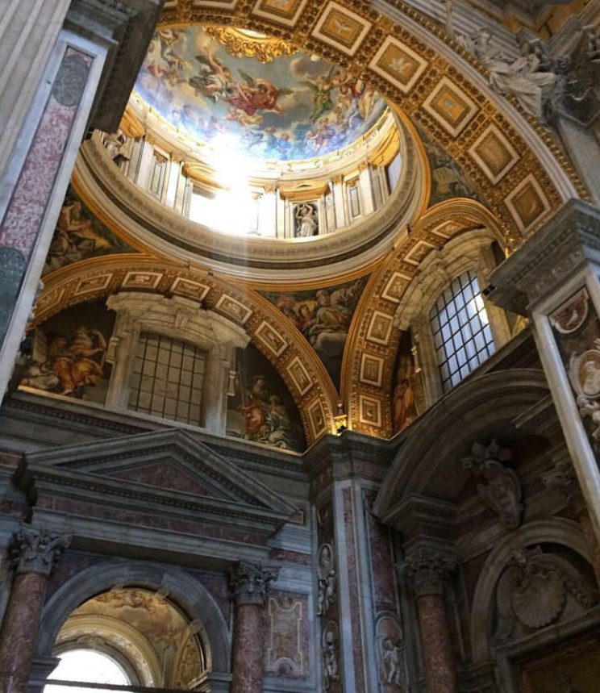

### **The Colosseum, the Forum and more**

So if you just landed in Rome, or are planning a trip, you already know you are very likely going to the main attractions. Start maybe with a trip to the Colosseum, where you can also see the Roman Forum, the ancient meeting place in the center of ancient Rome. The ticket comes paired with the Colosseum so it is worth the time. While you are in the area, it is worth the trip to go up to the Farnese Botanical gardens and explore Palatine hill. It is one of Rome’s seven hills, and it’s most famous. According to Roman myth, there is the location of the cave where a wolf found the brothers Remus and Romulus. It was Romulus who would go on to found the city of Rome.

 - _The Pantheon_

### **Gelatos with the gods**

If you made the decision to go to Rome in the middle of summer as we did, you may want to cool off after all the running around under the hot sun. If you like ice cream, there are plenty of delicious Gelaterias around Trevi Fountain and the Pantheon, which both make a beautiful setting to sit down and snap a photo with your gelato. After a nice rest, you should head to the Spanish steps close by. Most importantly stop by Pastificio Guerra and get a take away pasta. This place is a hopping pasta shop, where they make all the pasta in house to serve, as well as packaged so you can bring some home with you.

 - _St.Peter's Basilica, Vatican City_

### **The smallest country**

Now allow us to warn you, make a detailed plan for seeing the Vatican, and the Sistine Chapel within. With so much to see and do in the city, we waited till the last day and there was some confusion on our part in buying a ticket. Sadly we left Rome without seeing the Sistine Chapel and that is a big part of why we immediately decided we will go back. The Vatican City itself is beautiful and St. Peter’s Basilica and the Papal tombs below is a must for any tourist in Rome. However, missing a chance to see Michaelangelo’s Sistine Chapel was painful, especially after all the videos we watched on it before our trip. We would also like to mention that admission to the Vatican museums is free on the last Sunday of every month between 9:00 and 12:30, excluding holidays such as Easter Sunday.

 - _Trastevere_

### **Trastevere, trust us!**

If you are more into nightlife, down the road from the Vatican is Trastevere. A colorful bohemian neighborhood in Rome filled with bars, more gelaterias, great restaurants, and beautiful buildings and street art. A great place to wander the streets at night to cap off a long day of exploring.

### **Your own experience**

Each person has their own experience when traveling, and don’t stick to some tour or path laid out by some stranger on the internet. Carve your own path, do what you want, see how you feel. We are no travel guides, just two people who want to share our experiences and mention places we certainly enjoyed on our trip. There is so much to see and do in Rome especially, and places we never got to see. So we will be back and maybe can do a part two to this story. Until then, enjoy your own unique experience. Ciao!
