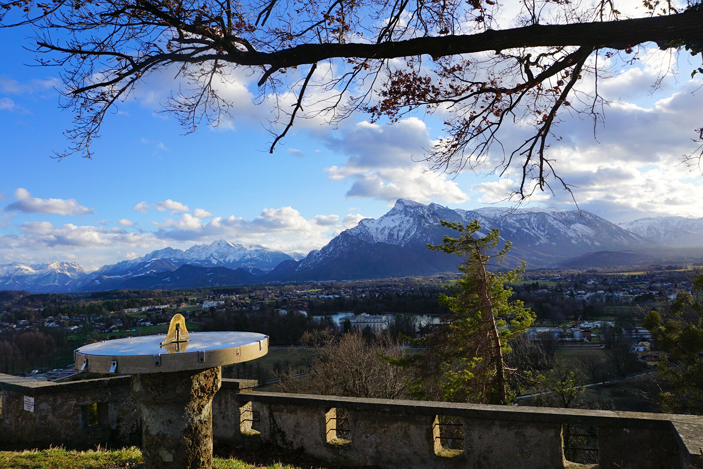
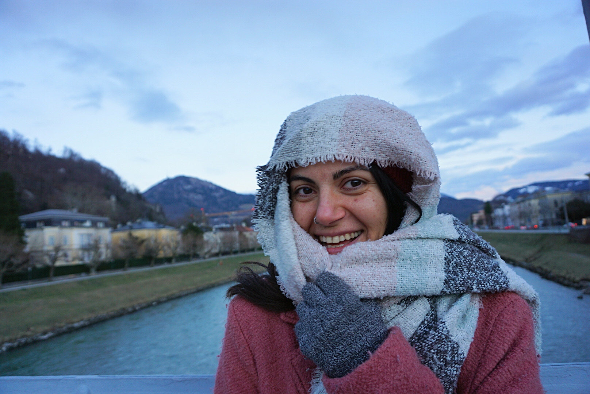
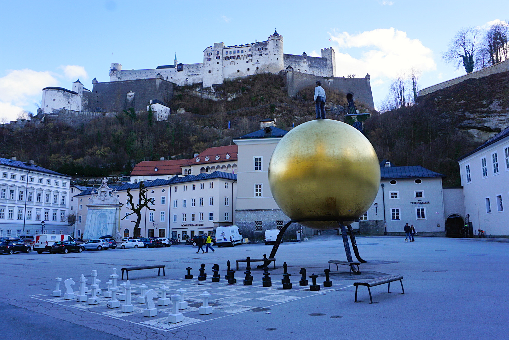
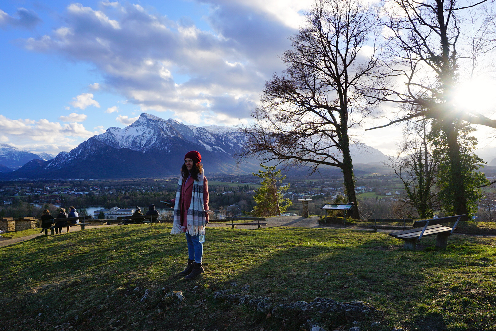

## Alpine adventure

After 3 years of living in Austria, we had prepared our plans to move away before our big move to the states. We wanted to do a mini trip around Europe before we left, which began with Salzburg. Though there are still many places within Austria we hadn’t got a chance to see (partially due to COVID travel restrictions) like Carinthia and Innsbruck, we decided on going to Salzburg before heading to other countries. I would like to write about each of these cities in this trip, so I felt the chronological order in which we traveled made the most sense. As a sort of mental recap of the trip, experiencing it again through the mind’s eye.

 - _Sundial on Richterhöhe_

## The mountain air

It’s always an interesting feeling for me when traveling to mountainous cities and villages, such as those within the Alpine country. As someone who doesn’t come from a very mountainous region, I feel somewhat dwarfed being surrounded by these behemoths. You step off the bus, or out of the train station, or whatever you traveled in on, and witness the swelling of the earth around you. Right as you get to Salzburg, you see the castles, walls, and forts around the city and notice the mountain air is a bit more fresh.

 - _Crossing bridge to Old Town_

## First stop Old Town

Whenever we first arrive in a new city, we always seem to first try and drop our bags off wherever we will be staying, then it’s off to explore the town center. As most of our travels so far have been around Europe, we tend to look for the ‘Old Town’ of the city. In Salzburg, the Old Town, or ‘Altstadt’ in German, lies on the Western half of the city. It is there you will also find some of the biggest attractions in Salzburg. One being right there in the birthplace of Austria’s pride and joy, Wolfgang Amadeus Mozart. With a big sign over the building you can hardly miss it.

 - _Beneath Fortress Hohensalzurg_

## Storming the fort

From the Old Town, if you are like us, it’s tough to not be tempted to want to climb up to the towering Fortress Hohensalzburg. We did it twice during our stay! The first time we got an amazing panoramic view over the city at sunset, though it was somewhat late when we discovered the beauty that is a bit further past the fortress. The viewpoint of the Alps from Richterhöhe am Monchsberg is something that really solidifies the meaning when someone says ‘awe-inspiring’. We spent over an hour up there looking over the mountains and the villages below, then came back the next day in time for sunset. That view and that moment alone was sublime, it defined the trip to Salzburg.

 - _View atop Richterhöhe_

## Sunsets over the Alps

There are some cities we go to where we don’t need to do all the stops, or fill our pockets with museum tickets. Some cities it is just enough to walk through the historical districts that so many have before us, touch the old structures that have been so weathered by time, maybe find yourself experiencing a moment with the natural world around you. Though we didn’t go to the salt mines, and missed other ‘touristy’ attractions in Salzburg, that sunset over the Alps was one of those rare moments when you know you are experiencing something you will never forget. I fell a little more in love with Austria for some time up there.
