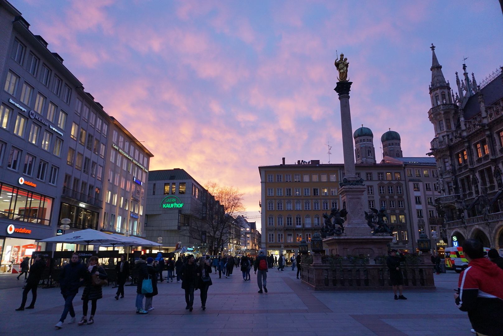

 - _Sunset at Marienplatz_

## Spontaneous decisions

It was on our last night in Salzburg that we spontaneously decided our next stop would be Munich. I had intended to go myself years before, and as it is quite close to where we were on the border of Austria, we jumped at the opportunity. We bought our train tickets the night before checkout. The next morning we scarfed down our breakfast and went to catch our train. As we arrived early we headed straight to our hostel nearby to drop our bags, charge our phones and take a rest before we headed out. We were excited about what adventures the city has to offer, so after our respite we headed off towards Old Town, as per our usual ritual.

 - _Mel in Old Town_

## Our Old Town ritual

A short walk from our hostel we found ourselves strolling through the city center of Munich at Marienplatz. Most days we found ourselves in this central square, and having seen it at nearly all hours of the day, we recommend going there at dusk. It is then you can catch the sunset and the shadows that cast over the square from the city hall that towers above.

 - _Inside Asamkirche_

## We love cathedrals, big and small

Nearby, just around the corner, you can find Asamkirche. This tiny baroque church is worth a quick stop if you enjoy visiting cathedrals (because we do!). We loved the beautiful woodwork on the main door, which opens up to the colorful fresco on the walls and ceilings and the shining stucco all around (I had to look up what it is called…). Be sure to take a seat in one of the central pews and take it all in. There is much to look at within such a compact church.

 - _Panorama of Viktualienmarkt_

## München on some pretzels

As our hunger grew, we headed out looking for some food to grab and found the nearby
Viktualienmarkt Biergarten. Beer gardens are a staple of Bavaria and are a great place to relax, have a pint, and grab a bite. It was there we had our first true Bavarian cuisine, beer and pretzels. Not exactly a full meal, but top it off with some spicy brown mustard and that will hold you over as you continue to wander around the city. There are many Beer Gardens all around the city, and although we did not get a chance to see it, we were told that Augustiner-Keller is very popular, as it is the oldest in the city.

 - _Our swan friend in the English Garden_

## A stroll through the garden

After throwing down some pints in the Beer garden we decided to take a stroll through another garden. We headed over to the largest park in the city, and one of the largest in the world, the English Garden. Towards the front you can find the Monopteros which provides a great viewpoint to watch the sunset over the city skyline. We also found ourselves among a motley crew of locals and tourists all sharing a beautiful moment, soundtracked by some German house music provided by the locals. There are a lot of beautiful trails, lakes, and ponds within the park, and we only scratched the surface of it due to its massive size. Though we were fortunate enough to spend time with some friendly wildlife. We would definitely like to explore more should we come again.

 - _Inside Hofbrauhas_

## More beer and pretzels

We don’t usually opt to do the overly touristy things (or at least we tell ourselves such) but one of my personal highlights from Munich would be Hofbrauhaus. Founded in 1589 by the Duke of Bavaria, it is one of the oldest beer halls in the city. It offers a lot in its history, as well as the traditional Bavarian music provided by men playing accordions in lederhosen, and women dressed in dirndls serving beer and massive pretzels. Here we also tried Obatzda, which is a traditional cheese spread often served with pretzels. In retrospect I should have ordered the huge beer mug in traditional Bavarian fashion, even if only for the novelty of it, but I opted for the half sized mug. Though I won’t be making that mistake again!

 - _Rathaus courtyard_

## Janissaries in Munich

When traveling, and getting caught up in the new experiences, whether it be the sights, or the food, it is often I am reminded that one of the best parts of seeing different places is the people you meet. That’s how Mel and I actually met! (More about that in a later post) It was in Munich we met one such character. When out on the street talking to a fellow hostel lodger, we were approached by Mr. Gary Red Rocks, a fellow American. I don’t know his actual surname, but his name was Gary and he had apparently once worked at Red Rocks (an amphitheater in Colorado). He was abroad with his girlfriend and enjoying some skiing in the Alps. What started as a brief encounter on the street outside our hostel turned into a night of drinks and some enthusiastic (and somewhat loud) talks about history in the hostel lobby. Gary was especially knowledgeable and excited to talk about Janissaries, and even went on to perform his rendition of a Janissary march. Though our stay was short, we had the opportunity to see quite a lot in Munich, and Gary was certainly one of the highlights. Hope you are doing well out there Gary, wherever you are.
